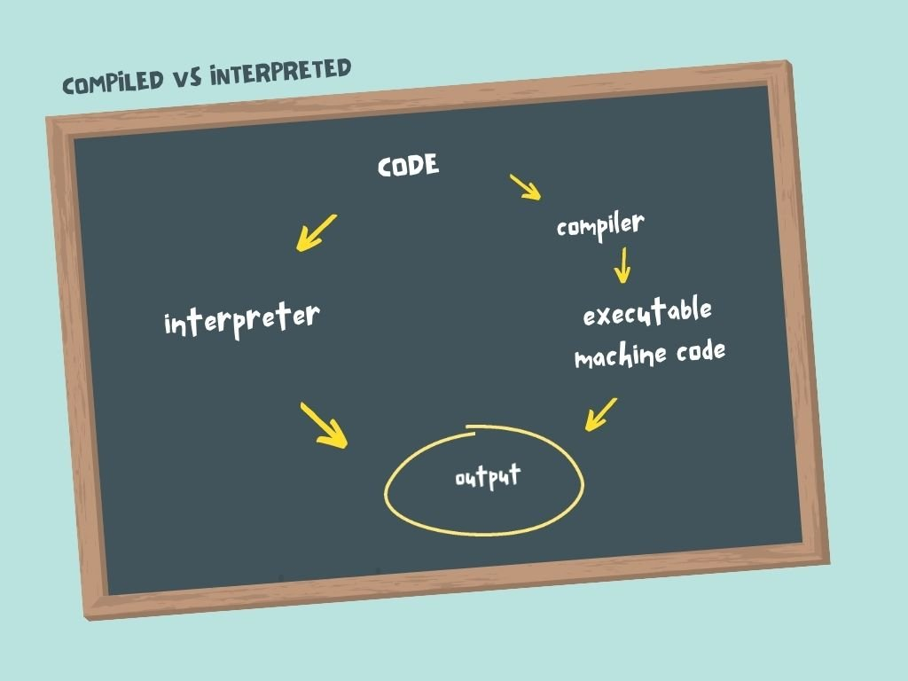

# Setting up GO Workspace

This was a bit difficult to do as i was really confused on what was going on. I am stil a bit confused but here's what i have understood.\
To get your go program running first thing you need is:
- a go.mod file, and
- a go.work file 

## `go.mod` 
To understand what are go.mod files let us imagine a recipe for baking a cake

- `go.mod` is like a recipe book for your go program
- As you make your cake(program) you add ingredients(modules) to the recipe list for your cake\

So basically `go.mod` serves as the place where you list your required module path

### Location

`go.mod` file resides in the directory where the module is present

## `go.work`

`go.work` serves as a higher-level-config file as compared to go.mod. It's main purpose is to define and organise relationship between various **go modules**. It gives us more control over how our program runs.\
To work with different modules we use directives like `use`, `replace` and `exclude`.

- As the name suggests `use` tells us which modules to be used
- For other directives GOOGLE

### Location

`go.work` resides in the root directory of your workspace

# Learning the Basics
Lets go line by line

- `package main`: This means that this code can be run stand alone 
- `main()`: This is the starting point of our code

Go code generally runs faster than interpreted languages and compiles faster than other compiled languages like C and Rust, however go code runs slower than compiled C and Rust counterparts.

## Compiled vs Interpreted

- In case of interpreted code when distributing your final proj you need to distribute your src code but in case of compiled code after building you get a machine executable code.
- Compiled programs can be run without access to the original source code, and without access to a compiler.
- One of the most convenient things about using a compiled language like Go for Textio is that when we deploy our server we don't need to include any runtime language dependencies like Node or a Python interpreter. 
- Therefore we just add the pre-compiled binary to the server and start it up!

## GO is static and strongly typed

- Go enforces strong and static typing, meaning variables can only have a single type. A **string** variable like` "hello world"` can't be changed to an **int**, such as the number 3.
- Contrast this with most interpreted languages, where the variable types are dynamic. Dynamic typing can lead to subtle bugs that are hard to detect.
- Two strings can be concatenated with the + operator. Because Go is strongly typed, it won't allow you to concatenate a string variable with a numeric variable.

## How GO handles memory?

Go programs are fairly lightweight
- Each program includes a small amount of "extra" code that's included in the executable binary. This extra code is called the Go Runtime. 
- One of the purposes of the Go runtime is to cleanup unused memory at runtime.

Here's an image comparing idle servers memory comparision\

